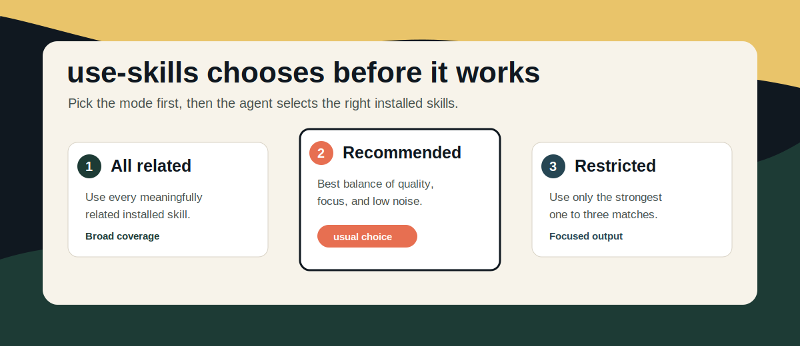

<p align="center">
  
</p>

<h1 align="center">use-skills</h1>

<p align="center">
  Choose the right installed skills before the agent starts working.
</p>

<p align="center">
  
  
  
</p>

`use-skills` helps an agent choose a relevant working set of installed skills for complex work.

It is useful when a request spans more than one area, such as planning plus coding, review plus testing, or writing plus structure.

## At A Glance

- reviews the available skill list
- asks the user to choose a mode before exploring when no prior mode applies
- shows likely skill candidates for each mode
- supports three modes: `All related`, `Recommended`, and `Restricted`
- starts with a short working-set block when used
- combines selected guidance into one coherent result
- stays unused when no skill is a strong match

## Install

```bash
npx skills add https://github.com/CyrusSE/use-skills --global
```

## Basic Use

```text
$use-skills
Turn this feature request into an implementation plan with testing notes.
```

The skill can also be selected automatically when the request is clearly multi-domain.

## Modes

When no previous mode applies, the skill asks before doing anything else. The prompt should be specific enough to help the user choose:

```text
Choose skill mode. Reply with 1, 2, or 3.

1. All related - use every available skill that is meaningfully related.
   Using: use-skills, planning, testing, review, documentation
   For: broad coverage across structure, correctness, and clarity

2. Recommended - use the best balanced working set.
   Using: use-skills, planning, testing
   For: strong output without unnecessary noise

3. Restricted - use only the strongest matches.
   Using: use-skills, planning
   For: focused output with minimal skill involvement
```

It should not inspect files, search the workspace, select skills, or infer a mode before asking.

It should not ask again if the task and expected output have not materially changed. Words like `best`, `most relevant`, and `strongest` do not count as explicit mode choices.

### All related

Uses every available skill that is meaningfully related to the request.

This is best when the user explicitly wants broad skill coverage.

### Recommended

Uses the best balanced working set for the request.

This is the usual choice for broad quality improvement.

### Restricted

Uses only the strongest matches, usually one to three skills.

This is best when the user asks for focus or fewer skills.

## Output Shape

When used, the response begins with:

- `Mode: All related | Recommended | Restricted`
- `Using: use-skills, <selected skill>`
- `For: <short purpose>`

Then the agent continues with the answer, plan, patch, or recommendation.

## Why The Mode Question Matters

The mode choice is intentionally asked before exploration. That avoids silently turning phrases like `best`, `most relevant`, or `strongest` into an assumed mode.

The user gets a clear choice:

- `1` for broad coverage
- `2` for balanced recommendations
- `3` for focused selection

## Good Fits

- planning a feature before implementation
- combining coding, testing, and review guidance
- improving a README or product spec
- reviewing a change with stronger structure
- choosing fewer skills for a focused answer

## Poor Fits

- narrow tasks where one skill is enough
- requests that only need a direct command
- work where no installed skill adds clear value

## Documentation Map

- [SKILL.md](./SKILL.md): runtime behavior
- [REFERENCE.md](./REFERENCE.md): selection model
- [examples/prompts.md](./examples/prompts.md): example prompts

## Repository Structure

```text
use-skills/
├── assets/
│   └── use-skills-mode-picker.svg
├── examples/
│   └── prompts.md
├── CONTRIBUTING.md
├── LICENSE
├── README.md
├── REFERENCE.md
└── SKILL.md
```
